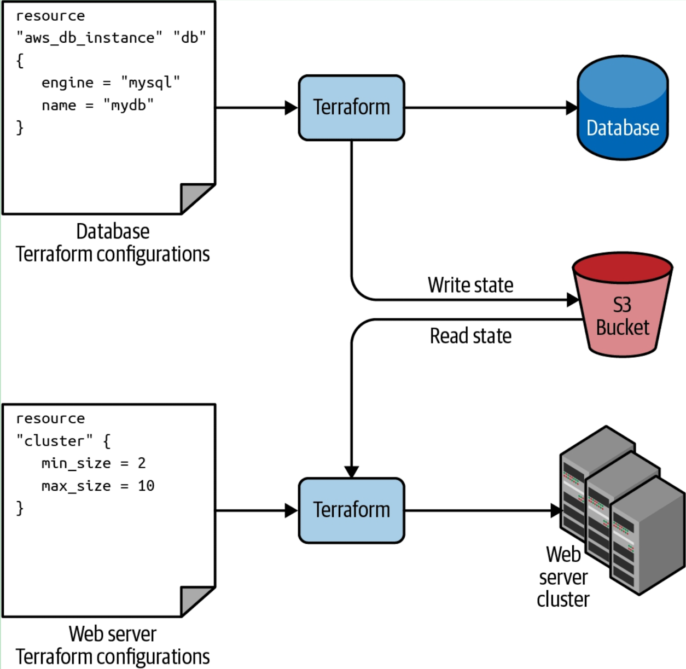

## How to read Output Variables from 'Remote State'
In order to use variables from another TF Project
1. The Target Project must specify 'Outputs' ([tf-db-mysql->outputs.tf](../../data-stores/tf-db-mysql/outputs.tf))
1. The Target Project must store its ['backend state'](../../data-stores/tf-db-mysql/backend.tf) remotely
1. The Source Project must setup a read only ['Data Source'](datasources.tf) pointing at the remote state
1. The Source Project must use the [data.terraform_remote_state](main-auto-scaling-groups.tf) syntax to access the Output Variable(s) from the Remote State

